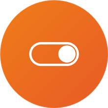

  

<h1 align="center">Domestia for Home Assistant</h1>

  🇬🇧 <a href="#english">English</a> &nbsp;|&nbsp; 🇫🇷 <a href="#francais">Français</a>

---

## English

A native Home Assistant integration for a **Domestia DMC-008** lighting controller:
talks directly to the controller over TCP (no external bridge, no MQTT broker required),
configured entirely from the Home Assistant UI, with automatic relay discovery.

A Python reimplementation of the protocol used by the Go project
[go-domestia](https://github.com/victorjacobs/go-domestia) (now archived).

### Features

- Added and configured 100% through the Home Assistant UI (no YAML)
- Automatically discovers how many relays the controller manages
- One `light` entity created per relay, with a generic name (`Domestia relay N`) until
  you rename it
- A **Configure** screen to rename a relay, mark it dimmable, or flag it as "always on"
  (not exposed as an entity, but kept at full brightness)
- A single grouped poll (one network round trip) for every relay, however many there are
  (tested with ~30 relays)

### Installation via HACS

1. In HACS, ⋮ menu → **Custom repositories** → add this repository's URL, category
   *Integration*.
2. Search for "Domestia" in HACS → **Download**.
3. Restart Home Assistant.
4. **Settings → Devices & services → Add integration → Domestia**, enter the
   controller's IP address.

### Manual installation

Copy the `custom_components/domestia` folder from this repository into
`<Home Assistant config>/custom_components/`, restart HA, then add the integration as
above.

### Configuration

No YAML is needed. Once the integration is added, the **Configure** button on its card
(Settings → Devices & services) lets you:

- pick the refresh interval (10 seconds by default)
- edit a specific relay: display name, dimmable or not (`dimmable`), always-on
  (`always_on`)

Relays you haven't customized stay visible with their generic name and a default
**non-dimmable** (simple on/off) behavior, not always-on — turn on `dimmable` for the
relays that actually support it.

### License

See [LICENSE](LICENSE).

### Acknowledgments

This project is a Python reimplementation of the Domestia DMC-008 wire protocol
originally reverse-engineered in Go by **Victor Jacobs** in
[go-domestia](https://github.com/victorjacobs/go-domestia) (now archived). His work
figuring out the controller's binary framing and command bytes made this Home Assistant
integration possible — thank you for documenting it. This repository carries no code
copied from that project (its own repository has no LICENSE file to reuse); only the
protocol knowledge was carried over, reimplemented independently in Python.

---

## Français

Intégration Home Assistant native pour un contrôleur d'éclairage **Domestia DMC-008** :
communication directe en TCP avec le contrôleur (aucun bridge externe, aucun broker MQTT
requis), configuration entièrement depuis l'interface Home Assistant, et découverte
automatique des relais.

Réimplémentation Python du protocole utilisé par le projet Go
[go-domestia](https://github.com/victorjacobs/go-domestia) (désormais archivé).

### Fonctionnalités

- Ajout et configuration 100% via l'UI Home Assistant (aucun YAML)
- Découverte automatique du nombre de relais gérés par le contrôleur
- Une entité `light` créée par relais, avec un nom générique (`Domestia relay N`) tant
  qu'il n'est pas personnalisé
- Écran **Configurer** pour renommer un relais, le passer en variateur (`dimmable`) ou le
  marquer "toujours allumé" (non exposé comme entité, mais maintenu à pleine luminosité)
- Un seul polling groupé (une requête réseau) pour l'ensemble des relais, quel que soit
  leur nombre (testé avec ~30 relais)

### Installation via HACS

1. Dans HACS, menu ⋮ → **Dépôts personnalisés** → ajoute l'URL de ce dépôt, catégorie
   *Intégration*.
2. Recherche "Domestia" dans HACS → **Télécharger**.
3. Redémarre Home Assistant.
4. **Paramètres → Appareils et services → Ajouter une intégration → Domestia**, renseigne
   l'adresse IP du contrôleur.

### Installation manuelle

Copie le dossier `custom_components/domestia` de ce dépôt dans
`<config Home Assistant>/custom_components/`, redémarre HA, puis ajoute l'intégration
comme ci-dessus.

### Configuration

Aucun YAML n'est nécessaire. Après l'ajout de l'intégration, le bouton **Configurer** sur
sa carte (Paramètres → Appareils et services) permet de :

- choisir la fréquence de rafraîchissement (par défaut 10 secondes)
- éditer un relais précis : nom affiché, variateur ou non (`dimmable`), toujours-allumé
  (`always_on`)

Les relais non personnalisés restent visibles avec leur nom générique et un
comportement par défaut **non-dimmable** (simple on/off) et pas toujours-allumé — active
`dimmable` sur les relais qui le supportent réellement.

### Licence

Voir [LICENSE](LICENSE).

### Remerciements

Ce projet réimplémente en Python le protocole binaire du contrôleur DMC-008,
initialement documenté en Go par [victorjacobs/go-domestia](https://github.com/victorjacobs/go-domestia)
(désormais archivé, sans fichier de licence explicite) — seule la connaissance du
protocole a été reprise, pas le code.
